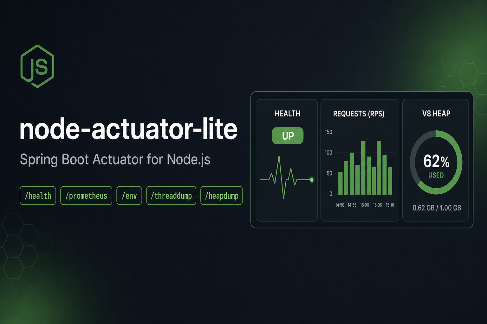

# Node Actuator Lite

[](https://github.com/beingmartinbmc/node-actuator-lite/actions/workflows/ci.yml)
[](https://badge.fury.io/js/node-actuator-lite)
[](https://www.npmjs.com/package/node-actuator-lite)
[](https://opensource.org/licenses/MIT)

Spring Boot Actuator for Node.js — lightweight monitoring endpoints, a built-in dashboard, and a single runtime dependency.

<p align="center">
  
</p>

## Why?

If you're coming from Spring Boot, you expect `/actuator/health`, `/actuator/info`, `/actuator/env`, and `/actuator/prometheus` out of the box. This library gives you exactly that for Node.js — **one dependency, zero config, and adapters for Express, Fastify, Koa, the built-in `http` module, and serverless**. It also ships a self-contained HTML dashboard so you can eyeball your service without wiring up Grafana first.

## Features

- **Health** — shallow (status only) and deep (per-component details), custom indicators, and health groups for Kubernetes liveness / readiness.
- **Info** — build metadata plus runtime details, with pluggable info contributors.
- **Metrics** — process-level CPU, memory, and uptime as JSON.
- **Environment** — `process.env` as Spring-style property sources, with automatic sensitive-value masking and an optional allowlist.
- **Thread Dump** — event-loop state, active handles/requests, V8 heap stats, and worker threads.
- **Heap Dump** — V8 heap snapshots saved to disk, throttled to prevent abuse.
- **Prometheus** — all default Node.js metrics plus custom counters, gauges, histograms, and summaries via `prom-client`.
- **Dashboard** — a self-contained HTML page at `/actuator/dashboard` that surfaces every enabled endpoint.
- **Discovery** — `GET /actuator` lists all enabled endpoints, just like Spring Boot.
- **Custom endpoints** — register your own routes under `/actuator`, per instance or globally.
- **Framework adapters** — Express, Fastify, Koa, and `node:http`, plus a serverless mode with direct method calls.
- **Pluggable auth & logging** — a single `auth` callback guards every endpoint, and any logger (pino, winston, …) can be injected.
- **Single runtime dependency** — `prom-client`.

## Production Safety

Actuator endpoints expose operational data. Keep them on a private network, behind authentication, or disabled unless you explicitly need them. This matters most for `/actuator/env`, `/actuator/threaddump`, and `/actuator/heapdump`.

A sensible public-facing baseline locks down the sensitive endpoints and gates everything behind an auth callback:

```typescript
import { NodeActuator } from 'node-actuator-lite';

const actuator = new NodeActuator({
  port: 8081,
  auth: ({ raw }) => true, // replace with a real token/allowlist check
  health: {
    showDetails: 'never',
    groups: {
      liveness: ['process'],
      readiness: ['diskSpace'],
    },
  },
  env: { enabled: false },
  threadDump: { enabled: false },
  heapDump: { enabled: false },
  prometheus: { enabled: true },
});
```

For the framework adapters, mount the actuator behind your existing auth or network allowlist, and enable `env`, `threaddump`, or `heapdump` only for trusted operators during short-lived debugging sessions.

## Installation

```bash
npm install node-actuator-lite
```

> Requires **Node.js >= 18**. The only runtime dependency is `prom-client`.

## Quick Start

### Standalone (HTTP server)

```typescript
import { NodeActuator } from 'node-actuator-lite';

const actuator = new NodeActuator({
  port: 8081,
  health: {
    showDetails: 'always',
    custom: [
      {
        name: 'database',
        critical: true,
        check: async () => ({ status: 'UP', details: { latency: '2ms' } }),
      },
    ],
    groups: {
      liveness: ['process'],
      readiness: ['diskSpace', 'database'],
    },
  },
  prometheus: {
    customMetrics: [
      { name: 'http_requests_total', help: 'Total HTTP requests', type: 'counter', labels: ['method', 'path'] },
    ],
  },
});

await actuator.start();
// Actuator listening on http://localhost:8081/actuator
// Dashboard at        http://localhost:8081/actuator/dashboard
```

### Express

```typescript
import express from 'express';
import { actuatorMiddleware } from 'node-actuator-lite';

const app = express();
const { handler, actuator } = actuatorMiddleware({ prometheus: { defaultMetrics: true } });
app.use(handler);

// All /actuator/* endpoints are now live.
// Access the actuator instance for custom metrics:
// actuator.prometheus.metric('my_counter')!.inc();

app.listen(3000);
```

### Fastify

```typescript
import Fastify from 'fastify';
import { actuatorPlugin } from 'node-actuator-lite';

const app = Fastify();
await app.register(actuatorPlugin, { prometheus: { defaultMetrics: true } });
// All /actuator/* routes registered. Access the instance via app.actuator.

await app.listen({ port: 3000 });
```

### Koa

```typescript
import Koa from 'koa';
import { actuatorKoa } from 'node-actuator-lite/middleware/koa';

const app = new Koa();
const { middleware, actuator } = actuatorKoa({ prometheus: { defaultMetrics: true } });
app.use(middleware);

// actuator.prometheus.metric('my_counter')!.inc();

app.listen(3000);
```

### Built-in `node:http` (and connect-style stacks)

```typescript
import http from 'node:http';
import { actuatorHttp } from 'node-actuator-lite/middleware/http';

const { handler, actuator } = actuatorHttp({ prometheus: { defaultMetrics: true } });

// As a standalone server:
http.createServer(handler).listen(8080);

// Or chained to your own router — requests outside basePath fall through to next():
// server.on('request', (req, res) => handler(req, res, () => myRouter(req, res)));
```

### Serverless (Vercel, Lambda, etc.)

In serverless mode no server is started; you call the data methods directly.

```typescript
import { NodeActuator } from 'node-actuator-lite';

const actuator = new NodeActuator({ serverless: true });
await actuator.start(); // no-op, no server started

const health  = await actuator.getHealth();          // shallow
const deep    = await actuator.getHealth('always');   // deep
const info    = await actuator.getInfoAsync();
const metrics = actuator.getMetrics();
const prom    = await actuator.getPrometheus();
const env     = actuator.getEnv();
const threads = actuator.getThreadDump();
const heap    = await actuator.getHeapDump();
```

## Endpoints

All endpoints live under the configured `basePath` (default `/actuator`). Each row appears in discovery only when its feature is enabled.

| Method | Path | Description |
|--------|------|-------------|
| GET | `/actuator` | Discovery — lists all enabled endpoints |
| GET | `/actuator/dashboard` | Self-contained HTML dashboard |
| GET | `/actuator/health` | Health check (shallow or deep based on config) |
| GET | `/actuator/health?showDetails=always` | Force deep health check |
| GET | `/actuator/health/{component}` | Single health component |
| GET | `/actuator/health/{group}` | Health group (e.g. `liveness`, `readiness`) |
| GET | `/actuator/info` | Build and runtime information |
| GET | `/actuator/metrics` | Process metrics (CPU, memory, uptime) as JSON |
| GET | `/actuator/env` | Environment variables (masked) |
| GET | `/actuator/env/{name}` | Single environment variable |
| GET | `/actuator/threaddump` | Thread / event-loop dump |
| POST | `/actuator/heapdump` | Generate and save a V8 heap snapshot |
| GET | `/actuator/prometheus` | Prometheus metrics (text exposition format) |

## Dashboard

A self-contained HTML dashboard is served at `<basePath>/dashboard` (enabled by default). It renders the discovery view and links to every enabled endpoint, with no external assets or CDN calls — useful for a quick look at a running service before reaching for a full metrics stack.

Disable it in locked-down environments:

```typescript
const actuator = new NodeActuator({ dashboard: { enabled: false } });
```

## Configuration

The full option shape lives in [`src/core/types.ts`](./src/core/types.ts) (`ActuatorOptions`). The most common options:

```typescript
interface ActuatorOptions {
  port?: number;            // default 0 (random); standalone server only
  basePath?: string;        // default '/actuator'
  serverless?: boolean;     // default false

  /** Authorization callback applied to every endpoint. Return false → 401. */
  auth?: (ctx: {
    method: string;
    subPath: string;
    query: Record<string, string>;
    params: Record<string, string>;
    raw?: unknown;
  }) => boolean | Promise<boolean>;

  /** Custom logger (pino/winston/…). Defaults to the built-in JSON console logger. */
  logger?: {
    trace(msg: string, data?: unknown): void;
    debug(msg: string, data?: unknown): void;
    info(msg: string, data?: unknown): void;
    warn(msg: string, data?: unknown): void;
    error(msg: string, data?: unknown): void;
  };

  info?: {
    enabled?: boolean;                  // default true
    build?: Record<string, any>;        // overrides auto-detected package.json info
    contributors?: Array<{
      name: string;
      collect: () => Record<string, any> | Promise<Record<string, any>>;
    }>;
  };

  metrics?: { enabled?: boolean };      // default true

  health?: {
    enabled?: boolean;                  // default true
    showDetails?: 'never' | 'always';   // default 'always'
    timeout?: number;                   // per-indicator timeout in ms, default 5000
    indicators?: {
      diskSpace?: { enabled?: boolean; threshold?: number; path?: string };
      process?: { enabled?: boolean };
    };
    groups?: Record<string, string[]>;  // e.g. { liveness: ['process'], readiness: ['diskSpace', 'db'] }
    custom?: Array<{
      name: string;
      check: () => Promise<{ status: 'UP' | 'DOWN' | 'OUT_OF_SERVICE' | 'UNKNOWN'; details?: Record<string, any> }>;
      critical?: boolean;               // if true, DOWN here → overall DOWN
    }>;
  };

  env?: {
    enabled?: boolean;      // default true
    mask?: {
      patterns?: string[];    // default ['PASSWORD','SECRET','KEY','TOKEN','AUTH','CREDENTIAL','PRIVATE','SIGNATURE']
      additional?: string[];  // extra variable names to mask
      replacement?: string;   // default '******'
      allowlist?: string[];   // if set, ONLY these variables are exposed at all
    };
  };

  threadDump?: { enabled?: boolean };   // default true

  heapDump?: {
    enabled?: boolean;      // default true
    outputDir?: string;     // default './heapdumps'
    minIntervalMs?: number; // throttle window between dumps, default 60000 (0 disables)
  };

  prometheus?: {
    enabled?: boolean;      // default true
    defaultMetrics?: boolean; // collect default Node.js metrics, default true
    prefix?: string;
    customMetrics?: Array<{
      name: string;
      help: string;
      type: 'counter' | 'gauge' | 'histogram' | 'summary';
      labels?: string[];
      buckets?: number[];   // histogram only
    }>;
  };

  /** Built-in HTML dashboard at `<basePath>/dashboard`. Enabled by default. */
  dashboard?: { enabled?: boolean };

  /** Custom endpoints mounted under basePath. */
  endpoints?: Array<{
    id: string;
    method?: 'GET' | 'POST';
    handler: (context?: {
      method?: string;
      path?: string;
      params?: Record<string, string>;
      query?: Record<string, string>;
      raw?: any;
    }) => any | Promise<any>;
    contentType?: 'json' | 'text';
  }>;
}
```

## Health — Shallow vs Deep

**Shallow** (`showDetails: 'never'`, or the default `GET /actuator/health`):

```json
{ "status": "UP" }
```

**Deep** (`showDetails: 'always'`, or `GET /actuator/health?showDetails=always`):

```json
{
  "status": "UP",
  "components": {
    "diskSpace": {
      "status": "UP",
      "details": { "total": 499963174912, "free": 250000000000, "threshold": 10485760, "path": "/" }
    },
    "process": {
      "status": "UP",
      "details": { "pid": 12345, "uptime": 3600, "version": "v20.11.0" }
    },
    "database": {
      "status": "UP",
      "details": { "latency": "2ms" }
    }
  }
}
```

### Health Groups

Model Kubernetes liveness and readiness probes:

```typescript
const actuator = new NodeActuator({
  health: {
    groups: {
      liveness: ['process'],
      readiness: ['diskSpace', 'database'],
    },
  },
});
```

- `GET /actuator/health/liveness` → aggregated status of `process` only
- `GET /actuator/health/readiness` → aggregated status of `diskSpace` + `database`

Returns HTTP **200** when UP, **503** when DOWN.

### Custom Health Indicators

```typescript
const actuator = new NodeActuator({
  health: {
    custom: [
      {
        name: 'redis',
        critical: true,
        check: async () => {
          const ok = await redis.ping();
          return ok
            ? { status: 'UP', details: { latency: '1ms' } }
            : { status: 'DOWN', details: { error: 'ping failed' } };
        },
      },
    ],
  },
});
```

Add or remove indicators at runtime:

```typescript
actuator.health.addIndicator({ name: 'cache', check: async () => ({ status: 'UP' }) });
actuator.health.removeIndicator('cache');
```

## Info

`GET /actuator/info` returns build metadata (auto-detected from `package.json`, or overridden via `info.build`) plus runtime details. Info contributors let you append computed sections:

```typescript
const actuator = new NodeActuator({
  info: {
    build: { name: 'orders-service', version: '1.4.2' },
    contributors: [
      { name: 'git', collect: () => ({ commit: process.env.GIT_SHA }) },
    ],
  },
});
```

```json
{
  "build": { "name": "orders-service", "version": "1.4.2" },
  "runtime": {
    "nodeVersion": "v20.11.0",
    "platform": "linux",
    "arch": "x64",
    "pid": 12345,
    "cwd": "/app",
    "uptime": 3600
  },
  "contributors": { "git": { "commit": "a1b2c3d" } }
}
```

## Metrics

`GET /actuator/metrics` returns process-level metrics as JSON (distinct from the Prometheus text endpoint):

```json
{
  "process": {
    "uptime": 3600,
    "memory": { "rss": 52428800, "heapTotal": 20971520, "heapUsed": 15728640 },
    "cpu": { "user": 1200000, "system": 350000 }
  }
}
```

## Environment

`GET /actuator/env` returns a Spring-style property-source response with sensitive values masked:

```json
{
  "activeProfiles": ["production"],
  "propertySources": [
    {
      "name": "systemEnvironment",
      "properties": {
        "PATH": { "value": "/usr/local/bin:..." },
        "DATABASE_PASSWORD": { "value": "******" }
      }
    },
    {
      "name": "systemProperties",
      "properties": {
        "node.version": { "value": "v20.11.0" },
        "os.hostname": { "value": "my-server" }
      }
    }
  ]
}
```

For defence-in-depth in production, set `env.mask.allowlist` so that **only** named variables are exposed and everything else is omitted entirely.

## Heap Dump

`POST /actuator/heapdump` writes a `.heapsnapshot` to `heapDump.outputDir` and returns metadata:

```json
{
  "timestamp": "2025-01-15T10:30:00.000Z",
  "pid": 12345,
  "filePath": "./heapdumps/heapdump-2025-01-15T10-30-00-000Z-a1b2c3d4.heapsnapshot",
  "fileSize": 15728640,
  "duration": 1250,
  "memoryBefore": { "heapUsed": 15728640 },
  "memoryAfter": { "heapUsed": 16777216 }
}
```

Heap dumps block the event loop, so requests are throttled to one per `heapDump.minIntervalMs` (default 60s). Open the `.heapsnapshot` file in Chrome DevTools → Memory → Load.

## Custom Endpoints

Mount your own endpoints under `basePath`. They appear in discovery and are served by every adapter.

Per instance, via config:

```typescript
const actuator = new NodeActuator({
  endpoints: [
    { id: 'build', handler: () => ({ commit: process.env.GIT_SHA }) },
  ],
});
```

Or at runtime on an instance:

```typescript
actuator.registerEndpoint({ id: 'cache-stats', handler: () => cache.stats() });
```

Or globally — useful for ecosystem packages that extend any actuator created afterwards:

```typescript
import { registerEndpoint } from 'node-actuator-lite';

registerEndpoint('feature-flags', () => flags.snapshot(), { contentType: 'json' });
```

## Serverless Integration

### Vercel

```javascript
// api/actuator/[...path].js
import { NodeActuator } from 'node-actuator-lite';

const actuator = new NodeActuator({ serverless: true });

export default async function handler(req, res) {
  const segments = req.query['...path'];
  const path = Array.isArray(segments) ? segments.join('/') : segments || '';

  switch (path) {
    case '':
      return res.json(actuator.discovery());
    case 'health':
      return res.json(await actuator.getHealth());
    case 'info':
      return res.json(await actuator.getInfoAsync());
    case 'metrics':
      return res.json(actuator.getMetrics());
    case 'env':
      return res.json(actuator.getEnv());
    case 'threaddump':
      return res.json(actuator.getThreadDump());
    case 'prometheus':
      res.setHeader('Content-Type', 'text/plain');
      return res.send(await actuator.getPrometheus());
    default:
      return res.status(404).json({ error: 'Not found' });
  }
}
```

### AWS Lambda

```typescript
import { NodeActuator } from 'node-actuator-lite';
import type { APIGatewayProxyEvent, APIGatewayProxyResult } from 'aws-lambda';

const actuator = new NodeActuator({ serverless: true });

export const handler = async (event: APIGatewayProxyEvent): Promise<APIGatewayProxyResult> => {
  const path = event.pathParameters?.proxy || '';

  const routes: Record<string, () => Promise<{ code: number; type: string; body: string }>> = {
    health: async () => ({ code: 200, type: 'application/json', body: JSON.stringify(await actuator.getHealth()) }),
    info: async () => ({ code: 200, type: 'application/json', body: JSON.stringify(await actuator.getInfoAsync()) }),
    metrics: async () => ({ code: 200, type: 'application/json', body: JSON.stringify(actuator.getMetrics()) }),
    env: async () => ({ code: 200, type: 'application/json', body: JSON.stringify(actuator.getEnv()) }),
    prometheus: async () => ({ code: 200, type: 'text/plain', body: await actuator.getPrometheus() }),
    threaddump: async () => ({ code: 200, type: 'application/json', body: JSON.stringify(actuator.getThreadDump()) }),
  };

  const route = routes[path];
  if (!route) return { statusCode: 404, body: '{"error":"Not found"}' };

  const result = await route();
  return { statusCode: result.code, headers: { 'Content-Type': result.type }, body: result.body };
};
```

## Programmatic API

Every endpoint has a method equivalent — no HTTP server required.

```typescript
const actuator = new NodeActuator({ serverless: true });

// Discovery
actuator.discovery();

// Health
await actuator.getHealth();                   // shallow or deep (based on config)
await actuator.getHealth('always');           // force deep
await actuator.getHealthComponent('diskSpace');
await actuator.getHealthGroup('readiness');

// Info & metrics
actuator.getInfo();         // sync, no contributors
await actuator.getInfoAsync(); // includes contributors
actuator.getMetrics();

// Environment
actuator.getEnv();
actuator.getEnvVariable('NODE_ENV');

// Thread dump
actuator.getThreadDump();

// Heap dump
await actuator.getHeapDump();

// Prometheus
await actuator.getPrometheus();

// Custom endpoints
actuator.registerEndpoint({ id: 'build', handler: () => ({ commit: 'abc' }) });
await actuator.invokeEndpoint('build');
```

## Ecosystem

`node-actuator-lite` is part of a small Node.js observability ecosystem you can adopt independently or together:

- **`node-actuator-lite`** — Spring Boot-style `/actuator/health`, `/info`, `/metrics`, `/env`, `/threaddump`, `/heapdump`, and `/prometheus` endpoints.
- [`node-eventloop-watchdog`](https://github.com/beingmartinbmc/node-eventloop-watchdog) — Detects event-loop stalls, captures stack traces and hotspots, and triggers recovery.
- [`node-request-trace`](https://github.com/beingmartinbmc/node-request-trace) — Per-request timelines, browser dashboard, and CLI without OpenTelemetry.

When all three are installed:

- `node-eventloop-watchdog` automatically registers `/actuator/eventloop`, `/actuator/eventloop/history`, `/actuator/eventloop/hotspots`, and `/actuator/eventloop/metrics` under this actuator.
- Event-loop block events include the active request id, route, and method captured by `node-request-trace`.

Runnable example: [`examples/ecosystem`](./examples/ecosystem).

> **Quickest setup:** Use [`node-observability-lite`](https://github.com/beingmartinbmc/node-observability-lite) to wire the three packages together with production-safe presets in one line.
>
> ```js
> const observability = require('node-observability-lite');
> observability.express(app, {
>   preset: 'production',
>   auth: req => req.get('authorization') === `Bearer ${process.env.OPS_TOKEN}`,
> });
> ```

## Examples

Runnable examples live in [`examples/`](./examples):

- Express app with bearer-token protected actuator routes
- Fastify app with safe endpoint defaults
- AWS Lambda handler using serverless mode
- Kubernetes deployment probes for liveness and readiness

## Contributing

See [CONTRIBUTING.md](./CONTRIBUTING.md) for development setup and release checks.

Security issues should be reported privately; see [SECURITY.md](./SECURITY.md).

Release notes are tracked in [CHANGELOG.md](./CHANGELOG.md).

## License

MIT — see [LICENSE](./LICENSE).
